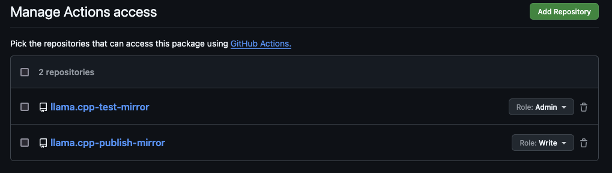

# Github action to mirror docker images between ggml-org and ggerganov

This script mirrors a set of tags from one repository to another. It is designed mirror WITHIN the same registry (ghcr.io in this case), by cross-mounting blobs. This prevents the need to download and re-upload the same data.

## Installation

1. Clone this repo
2. Modify `sync.py` to set your source, target repo and list of tags
3. Modify `.github/workflows/docker.yml`, uncomment the `schedule` section
4. Push it to your workflow repo

For example:
- `SOURCE_REPO` set to `ggml-org/llama.cpp`
- `TARGET_REPO` set to `ggerganov/llama.cpp`

This will copy images from `ggml-org` --> `ggerganov` (one-way sync)

NOTE: In our case, the workflow repo and the target repo are different, we will need to add permission to allow the workflow repo to push: Go to `https://github.com/users/YOUR_GITHUB_USERNAME_HERE/packages/container/llama.cpp/settings`

